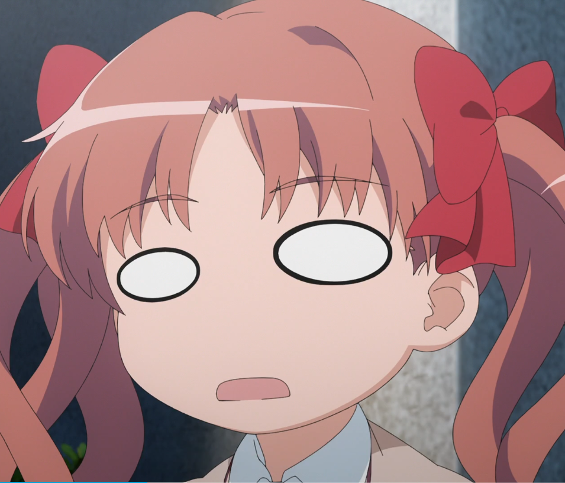

[toc]

# Black Humor Generator

**黑色幽默生成器**

这个项目本来准备做成一个在线生成黑色幽默风格的表情包图的网页的...

然而我既不会前端，也没钱买服务器买域名捣鼓解析，就把后端代码放在这了...

### 简单上手

```bash
#python bhg.py --source {你的图片名} --text {要添加的文字} 
```

程序会自动生成一张黑白风格的图片，你可以把它作为表情包或者沙雕图使用。

比如：



想在这样的一张图片底下添加些文字，使用：

```bash
#python bhg.py --source bhg/example/example_raw.png --text 失去梦想
```

就可以得到：


### 参数说明

- `--source <图片路径名>`:必选参数，指定原图路径名。

  可以指定网络上的图片链接。

  如果想要使用剪贴板的图片作为原图，请指定图片路径名为“~”。

- `--text <文字(,文字)>`:必选参数，指定在原图下方添加的文字。

  添加多行文字请用逗号隔开，带空格的文字请用引号括起，如

  “ --text "带 空 格,的 文 字" ”

- `--fontsize <数字(,数字)>`:可选参数，指定每行文字的字号。

  字号之间以逗号分隔，将依次分配给每行文字。

  未分配字号的文字将自动选择字号；多出的字号将被忽略。

  如

  ```bash
  #python bhg.py --source bhg/example/example_raw.png --text 失去梦想 --fontsize 20
  ```

  将会创造一张字体较小(20)的图片。

- `--lang <语种(,语种)>`:可选参数，指定每行文字的语种。

  语种之间以逗号分隔，将依次分配给每行文字。

  未分配语种的文字将被认为是`'zh'`（即中文）；多出的语种将被忽略。

  错误选择或未选择语种的文字将有可能显示乱码。

  现在，`bhg`附带了两个字体文件`OPPOSanS-M.ttf`和`MSMINCHO.TTF`，分别用于中文`'zh'`&英文`'en'`、日文`'jp'`的输出。对于这两个字体的使用，请遵循它们各自的使用许可协议。

- `--bg` <RGB颜色值>:可选参数，指定文字背景色。

  颜色以RGB格式给出，用逗号分隔，如

  (0,0,0) 代表 黑色

  (255,255,255) 代表 白色

  若背景较暗，将会自动选择白色作为字色，反之字色则会自动选择黑色。

   如

  ```bash
  #python bhg.py --source bhg/example/example_raw.png --text 失去梦想 --bg (255,255,255)
  ```

  将会创造一张白底黑字的图片。


- `--savepng` :可选参数，若指定该选项则会保存图片为png格式在当前目录下，

  文件名为(第一行文字).png。

   如

    ```bash
    #python bhg.py --source bhg/example/example_raw.png --text 失去梦想 --savepng
    ```

    将会保存一张名为“失去梦想.png”的图片。


### 作为包引入

使用`from bhg import BHG`导入执行类`BHG`，再定义一个实例(如`painter=BHG()`)，即可在其他Python代码里面接入黑色幽默生成器。

- `BHG.source(s:str)`：即`--source s`，导入原图。

- `BHG.text(s='',font_size=0,lang='zh')`：加入文字s，其字号为`font_size`，语种为`lang`。

  s可以指定为字符串列表，这样可以一次性添加多行文字，类似地，`font_size`和`lang`也可以为列表，它们的值将依次定义对应行文字的字号和语种。

- `BHG.savepng(flag=True)`：即`--savepng`。如果之前已经创建过图片，不想保存图片，可以使用`savepng(False)`来设定为显示接下来生成的图片。

- `BHG.make()`：以当前的各项设置生成一张图片。

- `BHG.clear()`：将上一个图片生成设置清空，这样就可以再生成下一张图片了。

- `BHG.list_setting(human_readable=False)`：显示现在已经进行的设置。

  如果设置`human_readable=True`，则会生成易读的、易于debug的设置输出，其中的空项将被忽略。

### 异常处理

在输入正确的情况下，`BHG`的各项方法均会返回0。

在输入有误的情况下，`bhg`会向标准错误输出`stderr`输出错误信息并返回错误序号。

| 错误序号 | 错误原因               |
| -------- | ---------------------- |
| 1        | 图片不存在             |
| 2        | 字号应为整数           |
| 3        | 语种不存在             |
| 4        | 语种对应的字体不存在   |
| 5        | 缺少提示语             |
| 6        | 缺少图片               |
| 7        | 图片获取失败           |
| 8        | 剪贴板中不包含图片     |
| 9        | 输入的背景色格式不正确 |

### 注意事项

如果你使用了`--savepng`却找不到生成的图片在哪，先看看你的当前路径下有没有（执行Python的路径）。

### ...以及

发挥你的创造力，让你的朋友们噗嗤一声笑出来吧！